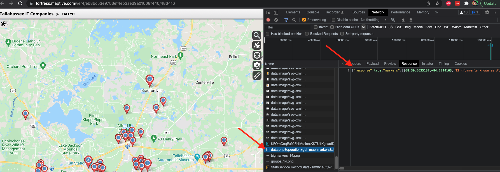
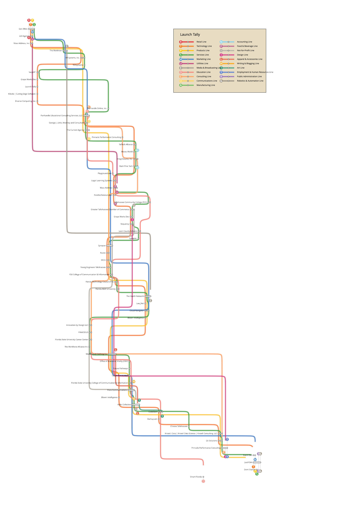

# Launch Tally Ecosystem Data Maps

## Geographical data

Ebe Randeree created a geographical map of [tally tech businesses on maptive](https://fortress.maptive.com/ver4/eb8bc53e9753ef4eb3aed9a01608f446/483416).

[Maptive API route](https://fortress.maptive.com/ver4/data.php?operation=get_map_markers&data_id=1056209&map_id=1055574&bounds=30.341448,-84.409308,30.637001,-84.082122&zoom=12&shared_map=1&lat_col=6&lng_col=7&name_col=0&pie_chart=0&aggregation=-1&cluster=true&group=all&group_col=-1&search_bounds=&q=&ss_type=3&highlight_search=true&show_all_when_zoomed=1&snapshot_id=483416) returns JSON with lat lon markers associated to names.

`bash getMaptiveData.sh > maptive.json` will download the JSON from this endpoint and save it to maptive.json.

+ Be nice!  These routes are unauthenticated & these endpoints may not be intended for regular use.  Download the JSON and prototype maps from your local cache of data.

## Launch Tally data

The LaunchPad for Launch Tally is hosted on [Ramenlife.co](https://tlh.ramenlife.co/)

Ramen life data model includes things like name, website, business types, industries, and team profiles.

+ `getData.sh` will pull organizations from https://tlh.ramenlife.co/ and save to `companies.json` and `startups.json`  The two endpoints for this data can be seen in this script.
+ Be nice!  These routes are unauthenticated & these endpoints may not be intended for regular use.  Download the JSON and prototype maps from your local cache of data.
+ `cleanData.js` will combine `companies.json` and `startups.json` into one data set and merge/remove some attributes to clean the data some

### Transit Map
+ `node cleanData.js > cleaned.json` will prepare the data for `makeMapData.js`
+ `node makeMapData.js > launchtally.json` prepares data in a format for the memory underground map https://memoryunderground.com/

## Other ideas
+ https://startupsac.com/sse/
+ Make a map that looks like a star map, on brand with launch

## Contributing

Please open issues, fork, pull requests, new repos etc.  This is repo was made in the spirit of sharing.  Please share and discuss in anyway you like!